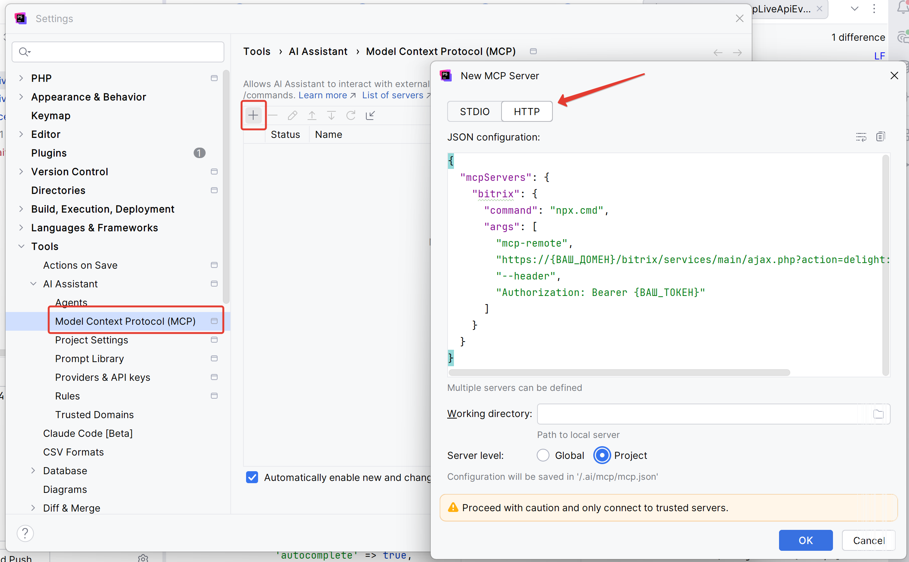

# 🚀 MCP сервер для 1С-Битрикс: Управление сайтом

Ссылка на модуль на Marketplace: https://marketplace.1c-bitrix.ru/solutions/delight.mcp/

Демонстрация работы модуля: https://rutube.ru/video/06d0f3f63a2f588ed5f0695aa674b468/

Модуль создан с целью улучшения качества разработки проектов на Битриксе с использованием AI-агентов.

Модуль реализует MCP сервер согласно официальной спецификации [Model Context Protocol](https://modelcontextprotocol.io/). Он представляет собой набор эндпоинтов, которые используются для связи AI-агента среды разработки непосредственно с сайтом и сервером. 

## ⚙️ Возможности MCP сервера

**Ресурсы:**
- Добавляет документацию [Bitrix Framework](https://github.com/bitrix-tools/framework-docs.git) (она же https://docs.1c-bitrix.ru/) в ресурсы MCP сервера, к которым агент может обращаться напрямую

**Инструменты:**
- Информация об окружении:
  - Информация о системе:
    - Название операционной системы;
    - Имя хоста;
    - Имя текущего пользователя;
    - Объем диска в байтах;
    - Объем свободного места на диске в байтах;
  - Информация о Битриксе:
    - Редакция;
    - Версия главного модуля;
    - Установленные модули;
  - Информация о PHP:
    - Версия PHP;
    - Подключенные расширения;
    - Ограничение по объему доступной оперативной памяти;
    - Максимальное время исполнения PHP-скриптов;
  - Информация о базе данных:
    - Тип базы данных;
    - Версия сервера баз данных;
    - Хост подключения;
    - Имя базы данных;
- Live API:
  - Список доступных функций в модуле;
  - Список доступных событий в модуле;
  - Поиск функций в модулях по проиндексированной базе;
  - Код функции модуля с её описанием PHPDoc;
  - Поиск функций через механизм Reflection по всему коду;
- Исполнение PHP-кода на сервере;
- Исполнение Shell-команд на сервере;
- Исполнение SQL-запросов на сервере;
- Поиск по документации Bitrix Framework (требует дополнительного подключения сервиса генерации embeddings):
  - Нормализует markdown-файлы документации Bitrix Framework перед индексированием;
  - Индексирует markdown-файлы документации Bitrix Framework в формате embeddings для поиска по смыслу, а не по вхождению;
  - Производит векторный поиск по документации Bitrix Framework по запросу от AI-агента.

## 🔔 Доступные события в модуле

| Имя события                 | Когда вызывается                                        | Параметры                                                                                                                                                                                                                                                                                                                                                                                                                                                                                       |
|-----------------------------|:--------------------------------------------------------|:------------------------------------------------------------------------------------------------------------------------------------------------------------------------------------------------------------------------------------------------------------------------------------------------------------------------------------------------------------------------------------------------------------------------------------------------------------------------------------------------|
| *OnBeforeExec*              | Перед исполнением shell-команд                          | `['command' => (string) $command]` <br/>Команда на исполнение                                                                                                                                                                                                                                                                                                                                                                                                                                   |
| *OnAfterExec*               | После исполнения shell-команд                           | `['output' => (array) $output]` <br/>Массив с построчным выводом исполненной команды                                                                                                                                                                                                                                                                                                                                                                                                            |
| *OnBeforeEval*              | Перед исполнением PHP-кода                              | `['code' => (string) $code]` <br/>Код на исполнение                                                                                                                                                                                                                                                                                                                                                                                                                                             |                                                               |
| *OnAfterEval*               | После исполнения PHP-кода                               | `['output' => (string) $output]` <br/>Экранный вывод исполненного кода                                                                                                                                                                                                                                                                                                                                                                                                                          |                                             
| *OnBeforeSql*               | Перед исполнением SQL-кода                              | `['query' => (string) $query]` <br/>SQL-запрос(ы) на исполнение                                                                                                                                                                                                                                                                                                                                                                                                                                 |                                           
| *OnAfterSql*                | После исполнения SQL-кода                               | `[`<br/>&nbsp;&nbsp;&nbsp;&nbsp;`'columns' => (array) $columns,`<br/>&nbsp;&nbsp;&nbsp;&nbsp;`'rows' => (array) $rows,`<br/>&nbsp;&nbsp;&nbsp;&nbsp;`'rowCount' => (int) count($rows),`<br/>&nbsp;&nbsp;&nbsp;&nbsp;`'query' => (string) $query`<br/>`];`<br/>Массив с результатом SQL-запроса                                                                                                                                                                                                  |
| *OnBeforeGenerateEmbedding* | Перед отправкой данных в сервис генерации эмбеддингов   | `[`<br/>&nbsp;&nbsp;&nbsp;&nbsp;`'url' => (string) self::GENERATE_EMBEDDINGS_ENDPOINT,`<br/>&nbsp;&nbsp;&nbsp;&nbsp;`'data' => Json::encode(['text' => $text]),`<br/>&nbsp;&nbsp;&nbsp;&nbsp;`'headers' => [`<br/>&nbsp;&nbsp;&nbsp;&nbsp;&nbsp;&nbsp;&nbsp;&nbsp;`'Content-Type' => 'application/json',`<br/>&nbsp;&nbsp;&nbsp;&nbsp;`],`<br/>&nbsp;&nbsp;&nbsp;&nbsp;`'timeout' => $this->timeout,`<br/>&nbsp;&nbsp;&nbsp;&nbsp;`'waitResponse' => true`<br/>`]`<br/>Массив с данными запроса |
| *OnAfterGenerateEmbedding*  | После получения данных от сервиса генерации эмбеддингов | `['response' => (bool\|string) $response]`<br/>Результат POST-запроса через \Bitrix\Main\Web\HttpClient                                                                                                                                                                                                                                                                                                                                                                                         |

## 🛡️ Безопасность
Доступ AI-агентов к модулю реализован с помощью JWT-токенов с возможностью указания времени жизни и прав токена на отдельные эндпоинты. Доступно удаление идентификаторов токенов со страницы настроек модуля, чтобы заблокировать доступ по ранее выпущенному токену.

Есть возможность ограничить доступ к настройкам модуля определенным группам пользователей.

Доступно логирование запросов/ответов к внешнему API модуля.

В модуле используются потенциально опасные функции `eval` и `exec`, которые могут быть приняты антивирусами за вредоносный код.
Эти функции позволяют AI-агенту исполнять произвольный код на сервере, если у токена есть соответствующие права.
Во избежание ложных срабатываний антивируса рекомендуется добавить модуль в исключения. Код модуля открыт и можно самостоятельно убедиться, что использование этих функций не является уязвимостью.

**Токены с правами на исполнение PHP/Shell/SQL кода рекомендуется использовать только на тестовых площадках! Помните, что AI-агенты ошибаются и могут удалить или испортить ваши данные.**

## 🔌 Примеры подключения MCP сервера
<details>
<summary>Cursor</summary>

Файл `mcp.json`:
```
{
  "mcpServers": {
    "bitrix": {
      "command": "npx",
      "args": [
        "mcp-remote",
        "https://{ВАШ_ДОМЕН}/bitrix/services/main/ajax.php?action=delight:mcp.Rpc.handler",
        "--header",
        "Authorization: Bearer {ВАШ_ТОКЕН}"
      ]
    }
  }
}
```
</details>

<details>
<summary>JetBrains IDE (AI Assistant)</summary>



Файл проекта `/.ai/mcp/mcp.json`:
```
{
  "mcpServers": {
    "bitrix": {
      "command": "npx.cmd",
      "args": [
        "mcp-remote",
        "https://{ВАШ_ДОМЕН}/bitrix/services/main/ajax.php?action=delight:mcp.Rpc.handler",
        "--header",
        "Authorization: Bearer {ВАШ_ТОКЕН}"
      ]
    }
  }
}
```
</details>

### Особенности указания команды `npx`

Значение поля `command` может зависеть от операционной системы и окружения. Примеры:

```json
"command": "npx"
```
```json
"command": "npx.cmd"
```
```json
"command": "C:\\Program Files\\nodejs\\npx.cmd"
```
Если возникает ошибка запуска, укажите полный путь до `npx`.

### Особенности авторизации
В некоторых системах стандартный заголовок `Authorization` недоступен для чтения на бэкенде, в таких случаях можно использовать заголовок `X-Authorization`. 

## 🧠 Подключение embeddings-сервиса

*Т.к. документация Bitrix Framework автоматически добавляется в ресурсы MCP сервера и доступна AI-агенту по запросу, то острой необходимости в настройке поиска по документации нет, это лишь может сэкономить контекст.*

Для корректной работы сервиса поиска по документации Bitrix Framework требуется взаимодействие с сервисом генерации embeddings (векторных представлений текста), которые нужны для поиска не по содержанию, а по смыслу.
В качестве основного пути предлагается на собственном сервере поднять микросервис на Python (sentence-transformers), код микросервиса также предоставляется в модуле, но можно использовать и другие варианты (OpenAI, Olama и прочее) - для их использования нужно по событию `OnBeforeGenerateEmbedding` переопределить параметры запроса на генерацию embeddings, и по другому событию `OnAfterGenerateEmbedding` привести ответ к JSON-строке вида
```
"[-0.22979317605495453,-0.1455831080675125,-0.2588725686073303,0.0562337264418602,...]"
```

### Установка и настройка микросервиса Embeddings

Этот сервис должен работать в фоновом режиме и автоматически запускаться после перезагрузки сервера.

Инструкция ниже предназначена для **BitrixEnv 9+** и предполагает, что все команды выполняются последовательно через SSH от **root**-пользователя. Все пути требуется актуализировать под ваше окружение.

<details>
<summary>Шаг 1: Установка Python и зависимостей</summary>

Эти команды установят Python, создадут изолированное окружение для сервиса и загрузят в него все необходимые библиотеки.

```bash
# Устанавливаем Python 3 и менеджер пакетов pip
sudo yum install -y python3 python3-pip

# Задаем путь к модулю
MODULE_PATH="/home/bitrix/www/bitrix/modules/delight.mcp"

# Переходим в директорию, где будет работать сервис
cd $MODULE_PATH/python

# Создаем виртуальное окружение в папке 'venv'
python3 -m venv venv

# Активируем окружение, обновляем pip и устанавливаем библиотеки
source venv/bin/activate
python3 -m pip install --upgrade pip
pip install fastapi uvicorn "sentence-transformers[txt]"
deactivate

# Меняем владельца всех файлов на bitrix, чтобы у сервиса были права доступа
sudo chown -R bitrix:bitrix $MODULE_PATH/python
```

</details>

<details>
<summary>Шаг 2: Создание фоновой службы (systemd)</summary>

Следующие команды создадут, настроят и запустят фоновый процесс.

```bash
# Задаем имя файла службы
SERVICE_FILE="/etc/systemd/system/delight.embeddings.service"

# Задаем путь к модулю
MODULE_PATH="/home/bitrix/www/bitrix/modules/delight.mcp"

# Создаем unit-файл для systemd с помощью команды tee
# Это позволяет запускать сервис от пользователя bitrix и автоматически перезапускать его
sudo tee $SERVICE_FILE > /dev/null <<EOF
[Unit]
Description=Delight Embeddings Generation Service
After=network.target

[Service]
User=bitrix
Group=bitrix
WorkingDirectory=$MODULE_PATH/python
ExecStart=$MODULE_PATH/python/venv/bin/python -m uvicorn embeddings-service:app --host 0.0.0.0 --port 8000
Restart=always

[Install]
WantedBy=multi-user.target
EOF

# Открываем порт 8000 в брандмауэре
sudo firewall-cmd --zone=public --add-port=8000/tcp --permanent
sudo firewall-cmd --reload

# Перечитываем конфигурацию systemd, включаем автозапуск и стартуем сервис
sudo systemctl daemon-reload
sudo systemctl enable delight.embeddings.service
sudo systemctl start delight.embeddings.service
```
</details>

<details>
<summary>Шаг 3: Проверка статуса</summary>

Чтобы убедиться, что сервис успешно запущен и работает, выполните:

```bash
sudo systemctl status delight.embeddings.service
```

Вы должны увидеть статус `active (running)`. Если возникли ошибки, их можно посмотреть командой `sudo journalctl -u delight.embeddings.service`.
</details>

### 💡 Другие решения разработчика для 1С-Битрикс:
- [Webp - Конвертер изображений в современный формат «на лету»](https://marketplace.1c-bitrix.ru/solutions/delight.webpconverter/) 🏆 2000+ установок
- [LazyLoad LITE - Отложенная загрузка изображений](https://marketplace.1c-bitrix.ru/solutions/delight.lazyloadlite/) 🏆 2000+ установок
- [LazyLoad PRO - Отложенная загрузка изображений, видео и iframe в 1 клик](https://marketplace.1c-bitrix.ru/solutions/delight.lazyload/)
- [Выбор даты и времени доставки](https://marketplace.1c-bitrix.ru/solutions/delight.deliverydatetime/)
- [PHP-условие в правилах работы с корзиной для реализации собственных условий скидок и наценок](https://marketplace.1c-bitrix.ru/solutions/delight.phpdiscounts/)
- [Расширенные накопительные скидки в правилах работы с корзиной](https://marketplace.1c-bitrix.ru/solutions/delight.cumulativediscounts/)
- [Асинхронизатор: асинхронная загрузка компонентов](https://marketplace.1c-bitrix.ru/solutions/delight.async/)
- [Предзагрузчик ресурсов](https://marketplace.1c-bitrix.ru/solutions/delight.resourcepreloader/)
- [Минификация HTML/JS/CSS](https://marketplace.1c-bitrix.ru/solutions/delight.minifier/) 

### 👨‍💻 Автор
[Дмитрий Кротов](https://t.me/delighter)

<br><br>
Модуль принёс пользу? Ты можешь оставить [отзыв](https://marketplace.1c-bitrix.ru/solutions/delight.mcp/) или поблагодарить разработчика:
https://yoomoney.ru/to/41001510540341
